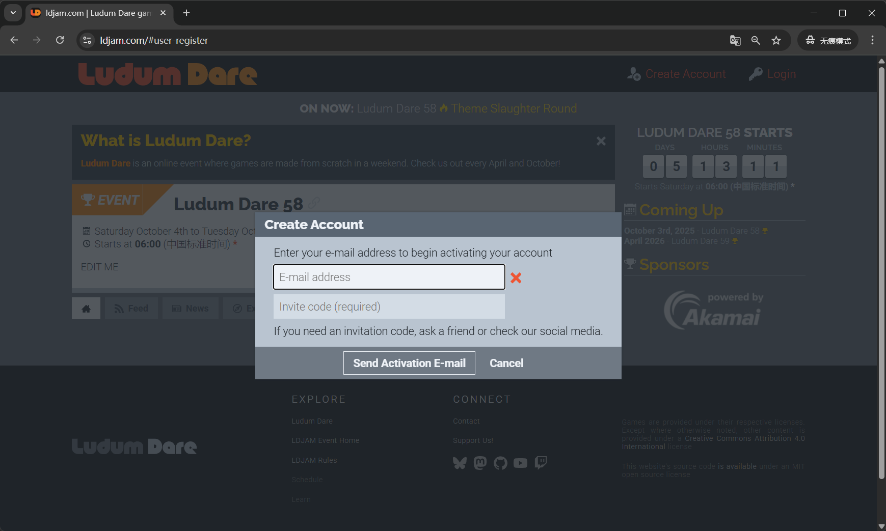
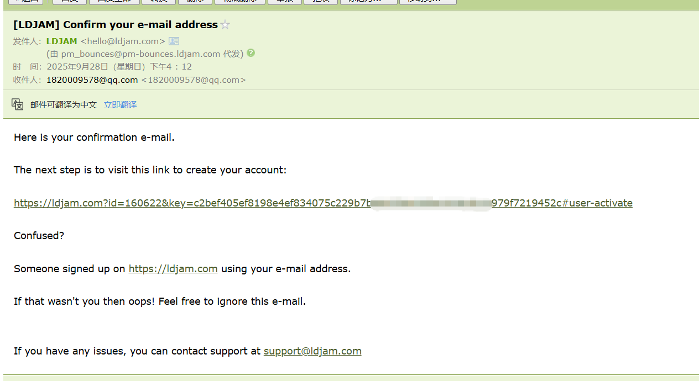
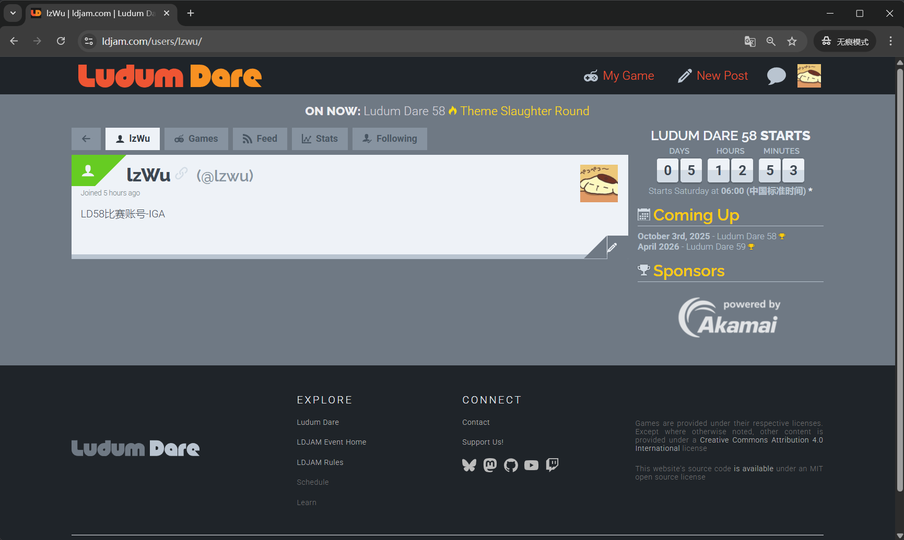
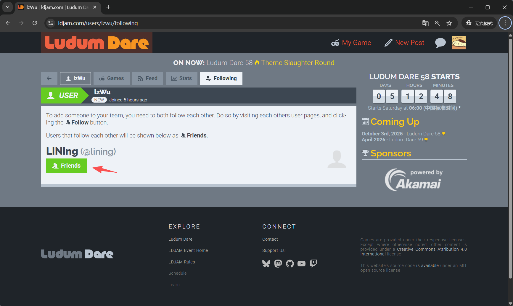
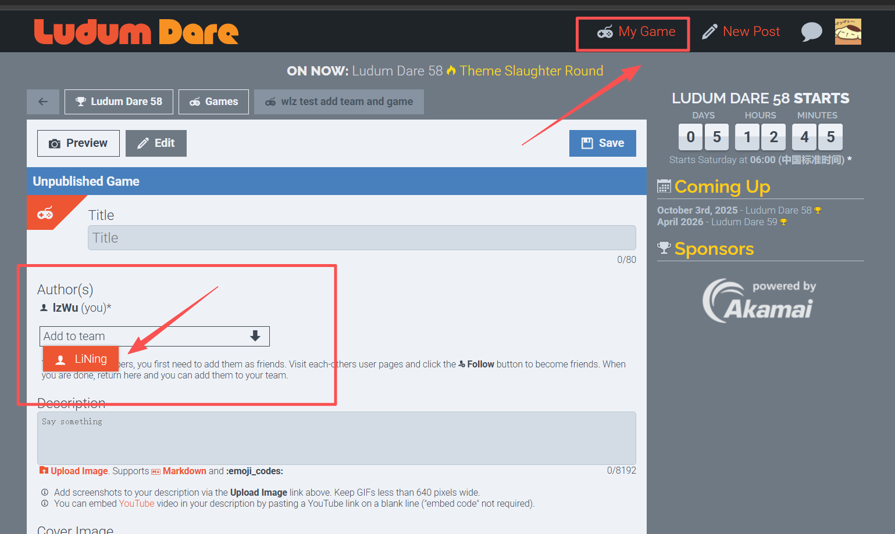
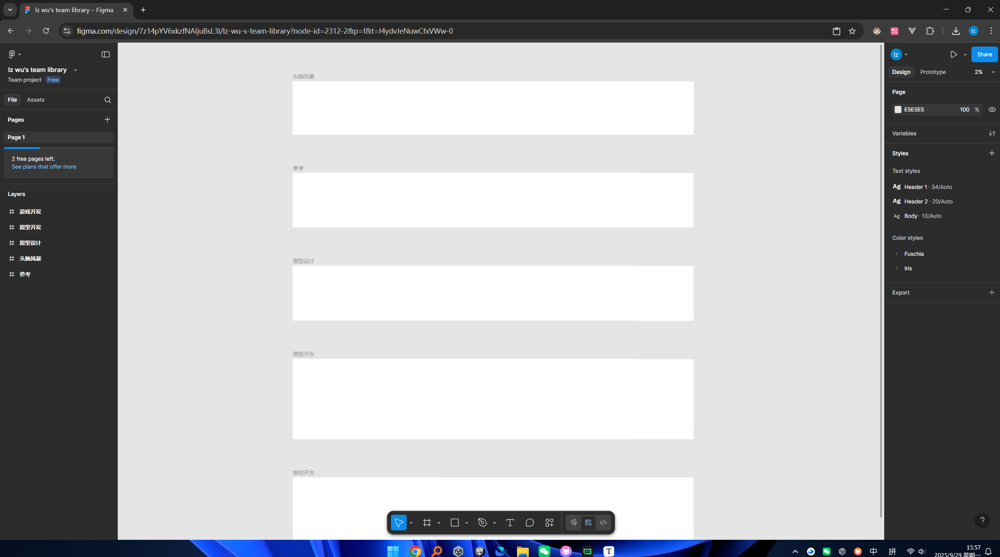

# **Ludum Dare指南**

##  1. 组队准备工作

### 1.1 注册账号

地址: https://ldjam.com/#user-register



**邀请码：**

```bash
adeliciouspumpkinjamincoming
```

注册成功后，需要到邮箱后台确认创建+设置密码



注册登录成功界面


### 1.2 组队

要添加团队成员，您首先需要将他们添加为好友。访问彼此的用户页面并单击 **“关注”** 按钮成为朋友。**（互相关注）**

互相关注界面展示的是 **“Friends”**



后续在发布游戏界面就可以添加成员



## 2.LD介绍

### 2.1简介

Ludum Dare，简称LD，是国外知名的独立游戏开发竞赛，首届比赛举办于2002年4月，迄今已走过足足57期，诞生了无数脍炙人口的经典作品。这个比赛最大的特点在于，每次官方都会提前公布一个主题，其中比较广为人知的即是要求参赛者必须在48小时独立完成所有开发工作的单人竞赛单元（The Competition）以及给予72小时开发时间，单人、组队均可的聚会单元（The Jam）。比赛要求，参与竞赛的开发者需要包揽从围绕主题拟定创意到编写代码、加入美术、音乐，提交游戏成品的全部工序，时间方面可谓相当严苛。

### 2.2  时间表（拟定）

| 时间                              | 时长 | 阶段                  | 说明                                                         |
| --------------------------------- | ---- | --------------------- | ------------------------------------------------------------ |
| **10月4日 06:00 – 10:00**         | 4h   | 主题公布 & 灵感发散   | 主题揭晓后，大家自由发想，快速头脑风暴，记录下所有可能的点子。 |
| **10月4日 10:00 – 15:00**         | 5h   | 游戏讨论（机制&设计） | 集中讨论选定的游戏方向，确定核心玩法、机制、风格，美术/程序分工。 |
| **10月4日 15:00 – 10月6日 12:00** | 45h  | 制作阶段              | 全力开发：程序写核心功能，美术产出素材，音效/音乐制作，保证可玩性。 |
| **10月6日 12:00 – 24:00**         | 12h  | 收尾 & 提交           | Debug、修复 BUG，优化体验，打包导出（WebGL/PC），写 itch.io 页面，最后上传提交。 |

**Day 1（10月4日）上午**：不要卡在选题太久，15:00 前必须定好方向。

**Day 2（10月5日）**：核心玩法必须能跑起来，留好迭代空间。

**Day 3（10月6日）上午**：必须能玩完整局（MVP 完成）。

**Day 3（10月6日）下午/晚上**：专心打磨体验 + 提交，不要到最后一分钟才上传。

## 3.游戏

### 3.1 游戏开发要点 

**创新：**

- **新颖有趣的玩法或机制**，哪怕画面简单，也能让玩家感受到趣味。
- 对策划来说，可以从 **规则、互动方式、目标变化** 上尝试创新，而不用担心画面复杂度。

**体量小而简单：**

- 游戏内容尽量精简，**先做最小可玩版本（MVP）**，确保玩法完整可体验。
- 不要追求多关卡、多角色、少而精**比“多而半成品”更有可能在 72 小时内完成。
- 3-10分钟内能通关。

### 3.2 素材工具

LD 允许使用现成素材，但必须在游戏发布页面标注出处。

- [爱给网](https://www.aigei.com/)：https://www.aigei.com  音效+游戏UI （已有会员 可任意下载素材）
- AI画图：
  - https://dreamifly.com
  - https://yiyan.baidu.com/task/painting
  - https://jimeng.jianying.com/ai-tool/home?type=image
- AI去背景：
  - https://www.remove.bg
  - https://cutout.designkit.com/
- AI对话
  - chat gpt  https://chatgpt.com/
  - claude https://claude.ai/new
  - baidu https://chat.baidu.com/
  - alibaba https://www.tongyi.com/
  - grok https://x.ai/
  - deepseek https://www.deepseek.com/


### 3.3 协作方式

腾讯会议72小时在线：待发起会议

画板Figma：已创建, 待邀请成员邮箱
https://www.figma.com/design/7z14pYV6xkzfNAIjuBsL3l/lz-wu-s-team-library?node-id=2312-2&t=I4ydvJeNuwCfxVWw-1




